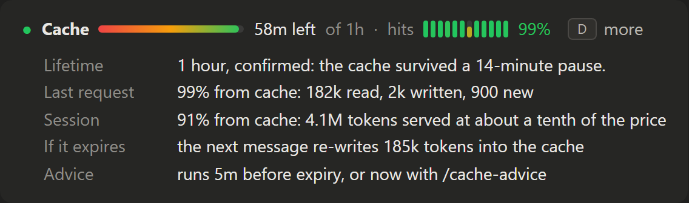
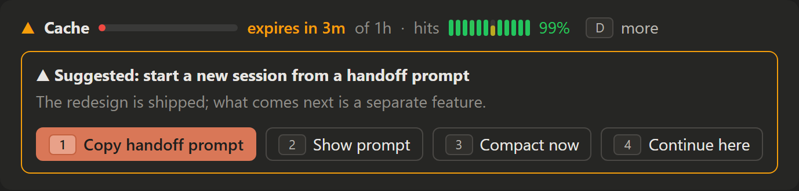
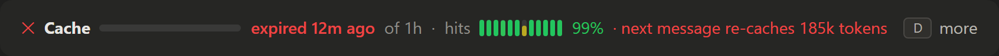

# claude-code-mods

Mods for [Claude Code](https://claude.com/claude-code): small plugins of function hooks that draw inside the
terminal or the desktop app's Code tab and react to what the session does. Each folder here is one
self-contained mod that works in any repository.

| Mod | What it does |
| --- | --- |
| [cache-watch](#cache-watch) | Shows the prompt cache's hit rate and time left, and suggests the cheapest way to carry on before the cache expires. |

> [!note]
> The function-hooks API is in early access and changes between Claude Code releases. These mods were
> built and checked against Claude Code **2.1.286**. If a mod stops loading after an update, run
> `claude plugin validate <mod folder>` to see what the engine now refuses.

## Install

Clone the repository anywhere:

```bash
git clone https://github.com/paweechinagarn/claude-code-mods.git
```

**For one terminal session**, pass the mod's folder:

```bash
claude --plugin-dir <clone>/cache-watch
```

**For every session**, the desktop app included, list the folder in the `env` block of
`~/.claude/settings.json`. Separate several folders with `;` on Windows and `:` elsewhere:

```json
{
  "env": {
    "CLAUDE_CODE_PLUGIN_DIRS": "<clone>/cache-watch"
  }
}
```

Interactive sessions watch these folders, so a `git pull` reloads the mod without a restart.

## cache-watch

Claude Code caches the start of every request. A cached token costs about a tenth of a normal input
token, but the cache only lives for a while after it was last used: one hour on most plans, five minutes
on others or during usage overage. Once it expires, the next message pays to write the whole
conversation into the cache again. On a long session that is the most expensive message you send.

### What it shows

One row above the prompt, readable at a glance. These images are mockups drawn with the mod's own bar
code and styled like the desktop app, so spacing in the app differs slightly.

**Fresh**, with the details panel open (**more**, or the `d` key):



**About to expire**, with the advice card:



**Expired**:



- **The bar and the time** count down from the last request that read or wrote the cache. The bar is shaded
  red to amber to green from left to right, so its shrinking end drifts into red. The time is green while fresh, amber in the last five minutes, red once expired. A symbol and words carry the state too, so it
  never rests on color alone.
- **Hits** is a sparkline of the last 12 requests and the share of the last request served from the cache.
  Each bar is shaded by its own hit rate on the same red, amber and green scale, so a miss shows red.
  Slots not yet filled show an empty track.
  Only the main conversation counts; subagents keep caches of their own.
- **more** (hotkey `d`) opens the details: the cache lifetime and how the mod knows it, the last
  request's and the session's token counts, and what an expiry would cost.

Claude Code does not report the cache lifetime on each request, so the mod assumes one hour until it sees
proof: a request after a pause of six or more minutes that still hits the cache (one hour), or misses it
(five minutes). A model switch reports the lifetime directly. The details panel says which of these it is.
On narrow windows the row drops the sparkline and the lifetime.

The desktop app, the editor extension and the phone draw both bars as vector graphics: a rounded
gradient pill and a row of rounded columns. The terminal draws them with line and block characters
instead.

### Advice before the cache expires

Five minutes before a one-hour cache expires, while you are idle, the mod asks the model one side question
over your conversation and shows its answer with three buttons:

| Option | When the model picks it |
| --- | --- |
| **Continue here** | The remaining work is short, or it really needs the full history. |
| **Compact now** | The task is mid-flight and the history holds a lot that is no longer needed. Compacting while the cache is warm is cheaper than after. |
| **Copy handoff prompt** | The work has reached a natural break. The mod has already written a self-contained prompt; paste it into a new session. **Show prompt** opens it in a pane. |

All three buttons are always there; the recommended one is highlighted. With under 30,000 tokens of
context the mod skips the question and says to continue, because re-caching a small context costs little.
Run `/cache-advice` to get the same advice at any time.

> [!important] The advice itself spends a little
> The side question reads the warm cache, about a twentieth of the cost of re-writing it, and that read
> also restarts the cache's one-hour clock. The mod asks once per idle stretch, so a session left alone
> all day spends one read, not one per hour.

### Alerts

- **Unexpected miss**: the cache missed within five minutes of the last request. Something changed the
  start of the prompt, such as the connected tools or MCP servers. Misses after a compaction, a model
  switch or a stale resume are expected and stay quiet.
- **Five-minute caching**: a request after a long idle gap missed the cache, so the session now looks like
  five-minute caching.

### Tuning

The constants at the top of [cache-watch/hooks/register.tsx](cache-watch/hooks/register.tsx):

| Constant | Default | Meaning |
| --- | --- | --- |
| `WARN_MIN` | `5` | Minutes before expiry that the advice runs. |
| `SMALL_CONTEXT` | `30_000` | Below this many tokens, advise continuing without asking the model. |
| `PROBE_GAP_MIN` | `6` | Idle minutes after which a request tells five-minute from one-hour caching. |

### Status

Version 0.2.0. Checked with `claude plugin validate` and a strict TypeScript build, and the line above
the prompt is confirmed drawing in the desktop app. The advice flow, the copy button on the desktop
surface and **Compact now** have not yet run in a real session.

## Writing your own

A mod is a folder with three files: `.claude-plugin/plugin.json`, `hooks/hooks.json` naming the module,
and the hooks module exporting `register(on)`. A mod that keeps state adds a `types/index.d.ts` contract.
Inside Claude Code, the bundled `plugin-authoring` skill holds the full API for the version you run.
`cache-watch` is a working example of a line above the prompt, a pane, a slash command, a timer and a
model fork.

## License

[MIT](LICENSE)
